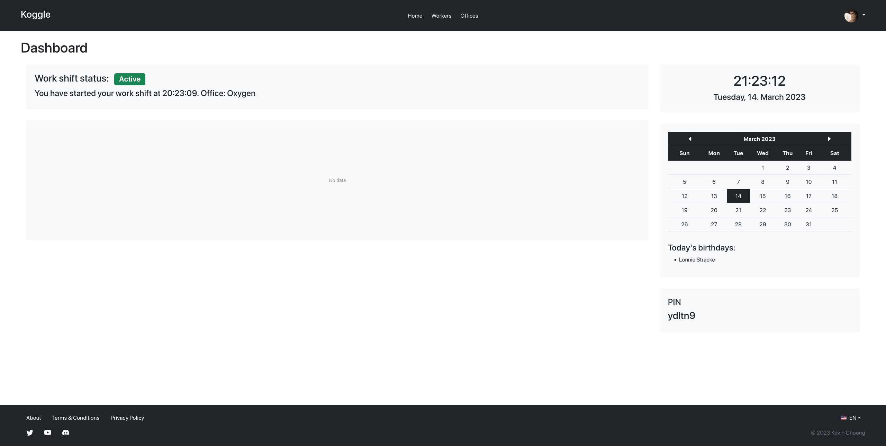
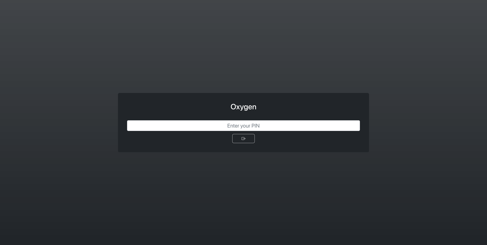
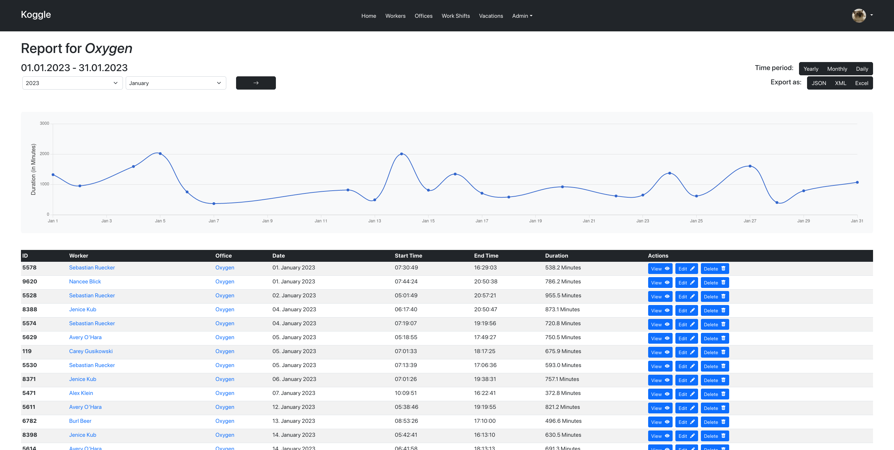
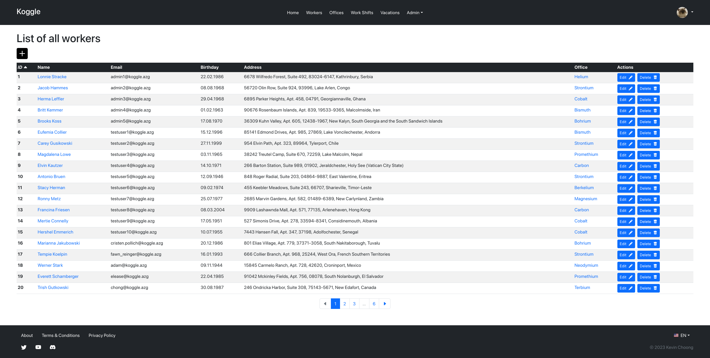

# Koggle

Project for Web Engineering Lecture WS2022/23.  
Kevin Choong, 33310631

This project is a time tracking system for a company, where the company can have multiple location and offices.  
The employees will check in and out of an office via a terminal webpage, that has to be setup in each location. 
To check in and out the employees need to currently enter their personal PIN code, that they can see on their dashboard after logging in. 

## System requirements

- **Ruby** 3.2.0
- **Rails** 7.0.4
- **Yarn** for JavaScript packages
- **SQLite** for database
- **ImageMagick & libvips** for image processing
- **crontab** for cronjobs

## Features

- Terminal for offices and buildings
- Report generation by year, month, day (HTML, JSON, XML, Excel)
- Graph representation of work shifts
- Role and permission management
- Vacation and birthday tracking
- Localization: English & German






## Installation and Deployment

```shell
git clone https://github.com/sekassel/abschlussprojekt-kchoong.git koggle
cd koggle
bundle install
rails db:drop db:create db:migrate db:seed # More information below
bin/dev
```

### Usage

I would recommend just logging in as an administrator user,
since many features aren't available to the public or the employees due to this being a work shift tracking system.
Further information to the development/test logins are below.

After logging in you will be redirected to the dashboard, where you can see time, date, your current work shift status, 
a graph of your working time for the current week and the PIN to check in and out of offices.
You can access all the indexes of the records via the navigation as an administrator.
In those tables you can execute further CRUD operations.

To simulate the check in and out process, 
you can simply go to the offices list and go to their terminal through the specified button.
On that page you can type in the PIN from your dashboard to check yourself in and out of the selected office.

For reports you can go to the details page of any worker or office of your choosing and click on the "Report"-Button.
On the report page you will be able to specify the range and date for the report. 
You will be also able to view the report in multiple formats.

### Important paths

- Terminal: `/terminal/$ID`
- Report for worker: `/workers/$ID/report`
- Report for office: `/offices/$ID/report`

## Database

For this project I will be using a simple SQLite database. To initialize the database run the following command:
```shell
rails db:drop db:create db:migrate
```

**Warning:** The seed will only generate test data and should not be used for production.  
To create some test data to play around with use the following seed command:
```shell
rails db:seed
```

### Development & Test Login

You can login to the development/test system, that contains the seed data with the following authentications:

For an administrator account use: 

- Username: `admin1`
- E-Mail: `admin1@mail.azg`
- Password: `admin1`

For an normal account use:

- Username: `testuser1`
- E-Mail: `testuser1@mail.azg`
- Password: `testuser1`

## Services

### Cronjobs

For the cronjobs I have used the gem [whenever](https://github.com/javan/whenever). To add the cronjobs of the project, run the following command:
```shell
whenever --update-crontab
```
This will add our cronjobs to the cron table of your system. You do not need to restart your cron service.

## Tests

The UI tests are currently not working, due to issues with Bootstrap.